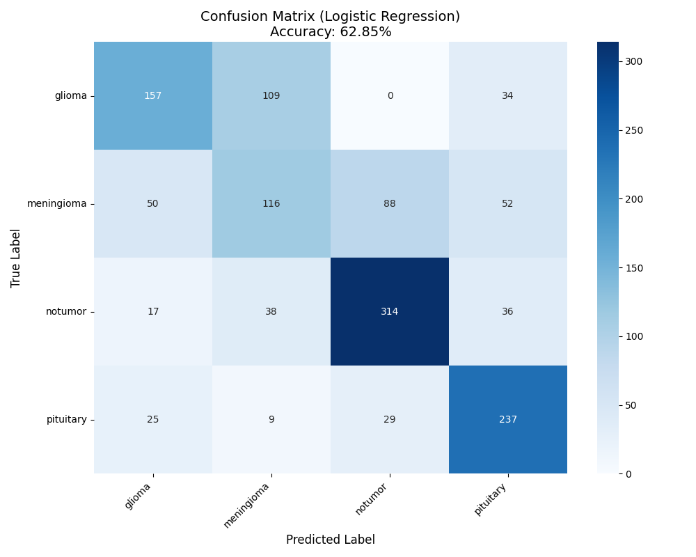
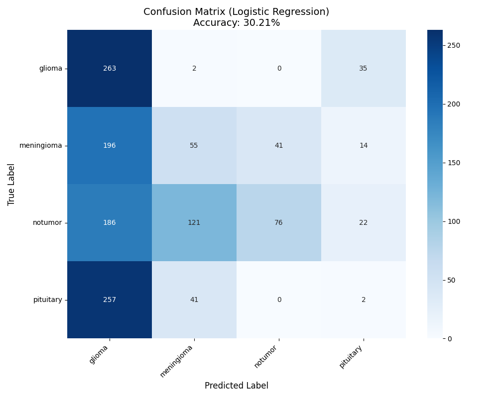
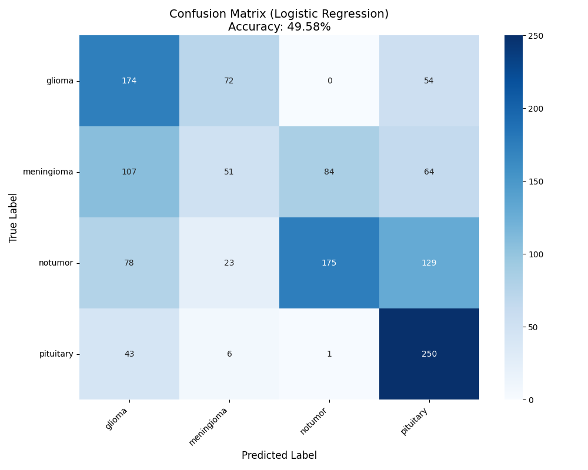
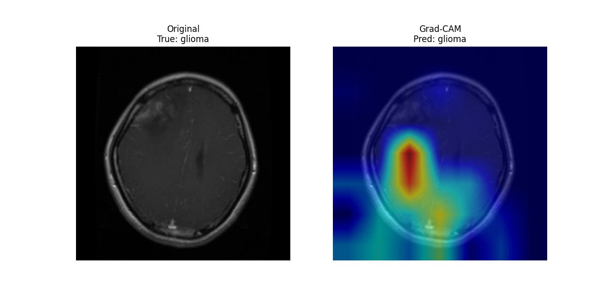
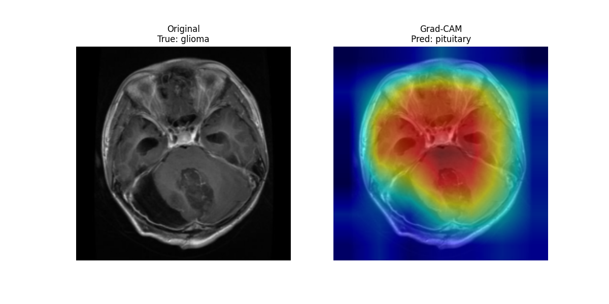
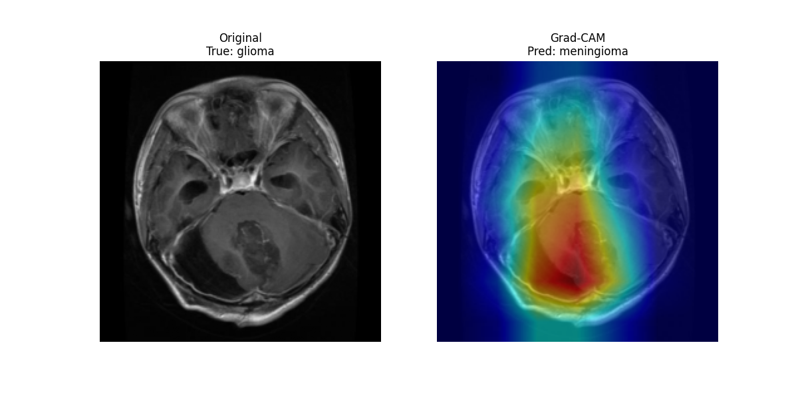

# Brain Tumor Recognition and Classification

## Project Overview

This project focuses on the automated recognition and classification of brain tumors using deep learning techniques. It addresses the real-world challenge of limited labeled medical data by applying a **SimCLR-based self-supervised learning approach** combined with **10-Shot-Learning** and **lightweight CNN backbones**.

Given the high stakes of early and accurate tumor detection in clinical environments, this system aims to:
- Detect whether an MRI image contains a tumor.
- Classify the tumor type (e.g., Glioma, Meningioma, Pituitary) if present.
- Provide visual explanations using Grad-CAM to highlight the regions of interest contributing to the model’s prediction.

Despite the constraint of having only **100-150 MRI images**, the model leverages strong data augmentation and contrastive representation learning (SimCLR) to learn discriminative features without relying on pretrained weights — in compliance with project constraints.

## Dataset Description

This project uses the [Brain Tumor MRI Dataset by Masoud Nickparvar](https://www.kaggle.com/datasets/masoudnickparvar/brain-tumor-mri-dataset), sourced from Kaggle. The dataset contains T1-weighted contrast-enhanced MRI scans of human brains, categorized into four classes:

| Class      | Description                                                                               |
|------------|-------------------------------------------------------------------------------------------|
| Glioma     | A tumor that originates in the glial cells of the brain.                                  |
| Meningioma | A typically benign tumor arising from the meninges (the membranes surrounding the brain). |
| Pituitary  | Tumors located in the pituitary gland, often affecting hormonal balance.                  |
| No Tumor   | MRI images without visible tumors (healthy brain scans).                                  | 

```
Brain-Tumor-MRI-Dataset/
├── glioma_tumor/
├── meningioma_tumor/
├── pituitary_tumor/
└── no_tumor/
```

- Total Images: ~3,000
- Format: .jpg
- Image Size: Varies, typically grayscale or RGB
- Preprocessing: Resize → Augmentation → Normalization

### Note
Due to project constraints, **only a subset of the dataset was used** (approximately 150–200 images total). This limited-data setup simulates a **few-shot learning environment**, suitable for self-supervised learning approaches like **SimCLR**.

## Result and Comparison

Despite being trained with a limited dataset of only ~150–200 images and with pretrained=False enforced, our SimCLR-based model demonstrates promising results in both classification accuracy and visual interpretability.

### Confusion Matrices

- Resnet18 Model:


- DenseNet121 Model:


- MobileNet-V2 Model:


### Grad-Cam Images

- Resnet18 Model:


- DenseNet121 Model:


- MobileNet-V2 Model:


### Loss/Epoch Graphs

- Resnet18 Model:

- DenseNet121 Model:

- MobileNet-V2 Model:


## Conclusion

As we can see in the graphs and images, more complicated models like DenseNet121 and MobileNet-V2 performed worse compared to the Resnet18 model.
The main reason for that can be simplified to having more layers therefore more overfitting during the training process.
The partial success of ResNet18 model shows that using SimCLR with 120 training images plus training a classifier fit to our classes with 10 images per class can be useful but there is still room for more improvement.

## Contributors

This project was made by me and my teammates. Here are their student number:

Funda Semiz: 220717039

İlayda Bozkurt: 220717037

## Credits

*This project was completed as part of the **SE3508 Introduction to Artificial Intelligence** course,
instructed by Dr. Selim Yılmaz, Department of Software Engineering at Muğla Sıtkı Koçman
University, 2025.*

*🚫 **Note**: This repository **must not be used by students in the same faculty** in future years—whether
partially or fully—as their own submission. Any form of code reuse without proper modification and
original contribution will be considered by the instructor **a violation of academic integrity policies.***